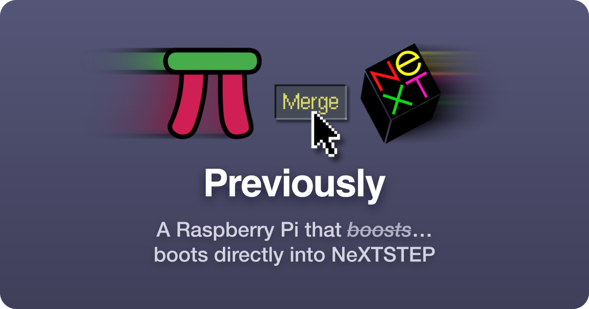

# previous.li

The website for [Previously](https://github.com/phranck/previously), a Raspberry Pi that boots directly into NeXTSTEP. What it is and how to install it is explained there.

There is no build step. Open `index.html` and it is the page.

`promo/` is the source of a 30 second film about Previously, with sound. [Its README](promo/README.md) says how the film is made.

## License

This repository has been published under the [MIT](https://layered.mit-license.org) license.
